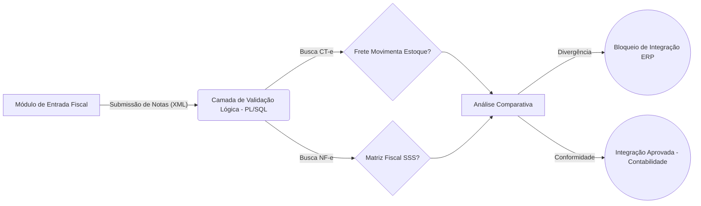

# Otimização de Conciliação Fiscal: Validação Automática de Custos (CT-e vs NF-e)

📌 O Desafio de Negócio
Na gestão de supply chain e contabilidade corporativa, a alocação imprecisa de custos de frete (CT-e - Modelo 57) sobre notas fiscais de produto (NF-e - Modelo 55) é uma grande dor operacional. Quando um sistema de ERP permite integrar uma nota de produto que movimenta estoque juntamente com um frete configurado para não movimentar (ou vice-versa), os custos logísticos deixam de ser agregados ao custo médio do estoque. Isso gera DREs (Demonstrativos de Resultados) distorcidos, subavaliação do inventário e demanda horas de auditoria manual da equipe fiscal e contábil. 

🎯 O Objetivo
* Garantir 100% de precisão na alocação de custos logísticos dentro do inventário da empresa.
* Bloquear proativamente a integração de documentos fiscais com configurações contábeis conflitantes (CFOPs, Contas e Cadastros de Itens).
* Automatizar a validação cruzada entre chaves de acesso referenciadas (CT-e > NF-e).
* Eliminar a necessidade de retrabalho ou estornos contábeis manuais no fim do mês.

📐 Arquitetura do Fluxo de Dados

🛠️ A Solução Técnica
A solução foi desenvolvida utilizando PL/SQL embarcado no gatilho (trigger) de validação do ERP. As principais abordagens técnicas incluem:

Processamento via Cursos Alinhados (Nested Loops): Identificação de todos os itens de frete ativos e validação exclusiva de suas referências, permitindo tratar N para N (Múltiplos fretes para múltiplas notas).

Concatenação Booleana (LIKE 'SSS'): Criação de uma matriz inteligente para checar instantaneamente as 3 camadas da operação (Tipo de Documento + Configuração do Item + Configuração do CFOP), simplificando lógicas complexas de IF/ELSE.

Regras Estritas baseadas em Padrões Contábeis: Uso dinâmico de máscaras de contas contábeis (113%) associadas a LIKE '%FRETE%' para isolar dinamicamente os impostos ou serviços, tornando o código à prova de novos cadastros temporários.

Fail-Fast Exception Handling: Identificação de divergências através de contadores (v_validador_status). Se a métrica de conformidade não for preenchida, uma exceção é lançada com um aviso claro e acionável para o usuário, poupando o uso de recursos de processamento adiante.

🚀 Impacto Esperado (ou Real)

Conformidade Contábil e Redução de Riscos: Eliminação total (0%) de divergências e vazamentos na apropriação de custos logísticos ao estoque.

Eficiência Operacional: Economia de dezenas de horas mensais que as equipes fiscais utilizavam na caça de inconsistências de integração entre fretes e mercadorias.

Governança de Dados para o BI: Garantiu que os dashboards de Custos e Margem Bruta consumissem dados nativamente limpos, sem necessidade de regras condicionais pesadas ou tratamentos no ETL para consertar erros de entrada humana.
